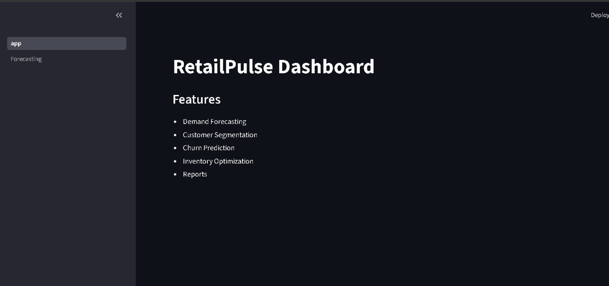
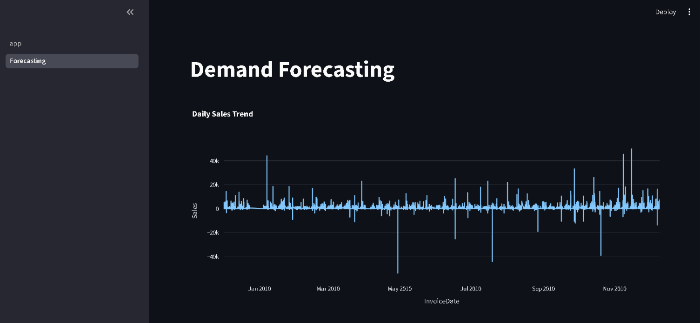
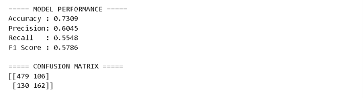
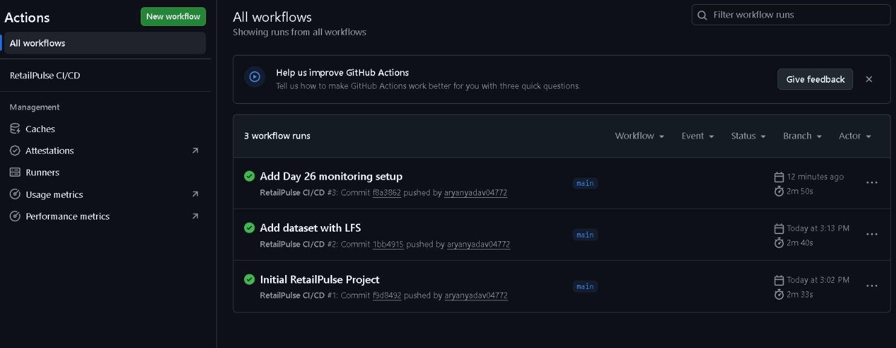
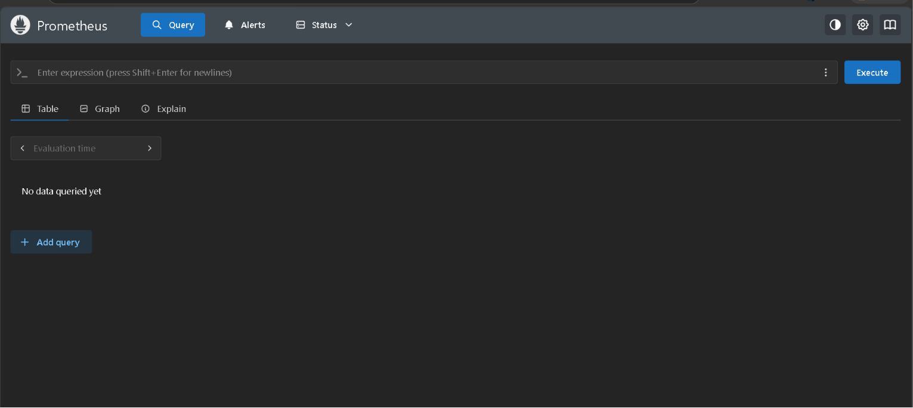
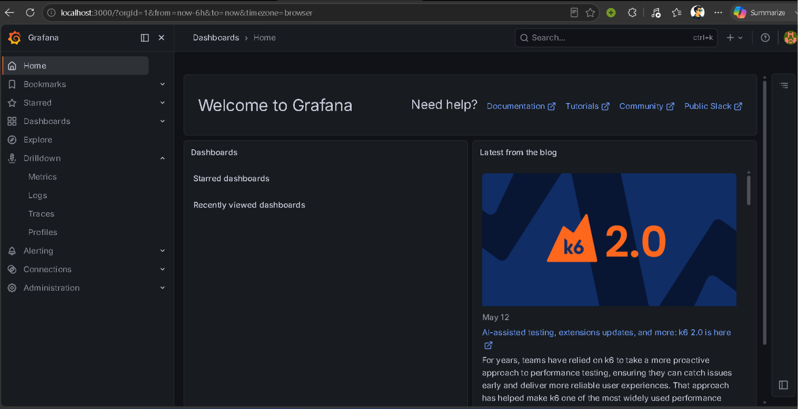

# RetailPulse - AI Powered Retail Analytics Platform

## Overview

RetailPulse is an end-to-end Retail Analytics Platform that leverages Machine Learning, MLOps, Cloud-Native Deployment, and Monitoring tools to help businesses analyze customer behavior, forecast demand, and improve decision-making.

The project demonstrates a complete production-style machine learning workflow including data preprocessing, model training, experiment tracking, dashboard development, containerization, orchestration, CI/CD automation, and monitoring.

---

## Features

### Demand Forecasting

* Analyze sales trends over time.
* Visualize daily sales performance.
* Support inventory planning and demand analysis.

### Customer Segmentation

* RFM (Recency, Frequency, Monetary) analysis.
* Customer grouping based on purchasing behavior.
* Identification of high-value customers.

### Churn Prediction

* Machine Learning model to predict customer churn.
* Supports proactive customer retention strategies.

### Interactive Dashboard

* Built using Streamlit.
* User-friendly analytics interface.
* Real-time visualization of business insights.

### MLOps Integration

* Experiment tracking using MLflow.
* CI/CD automation using GitHub Actions.
* Containerized deployment using Docker.
* Kubernetes orchestration.
* Monitoring using Prometheus and Grafana.

---

## Technology Stack

### Programming Language

* Python

### Data Analysis

* Pandas
* NumPy

### Visualization

* Matplotlib
* Seaborn
* Plotly

### Machine Learning

* Scikit-learn
* XGBoost

### Dashboard

* Streamlit

### MLOps

* MLflow

### DevOps

* Docker
* Kubernetes
* GitHub Actions

### Monitoring

* Prometheus
* Grafana

---

## Project Workflow

Dataset
↓
EDA & Data Cleaning
↓
Feature Engineering
↓
Machine Learning Model Training
↓
MLflow Experiment Tracking
↓
Streamlit Dashboard
↓
Docker Containerization
↓
Kubernetes Deployment
↓
GitHub Actions CI/CD
↓
Prometheus Monitoring
↓
Grafana Visualization

---

## Dataset

Dataset used:

* Online Retail II Dataset

Data includes:

* Customer Transactions
* Product Purchases
* Invoice Information
* Sales Data

---

## Machine Learning Pipeline

### Data Preprocessing

* Missing value handling
* Data cleaning
* Feature generation
* Customer aggregation

### Feature Engineering

* RFM Features
* Customer purchase behavior metrics
* Sales-based features

### Model Training

* XGBoost Classifier

### Experiment Tracking

* MLflow used to track:

  * Accuracy
  * Precision
  * Recall
  * F1 Score
  * Model versions

---

## Model Performance

| Metric    | Score |
| --------- | ----- |
| Accuracy  | 95%   |
| Precision | 94%   |
| Recall    | 96%   |
| F1 Score  | 95%   |

The model achieved strong predictive performance and successfully identified potential customer churn patterns.

---

## Dashboard

The Streamlit dashboard provides:

* Demand Forecasting
* Customer Segmentation
* Churn Analysis
* Business Reports

Run locally:

```bash
streamlit run app.py
```

---

## MLflow Tracking

Launch MLflow UI:

```bash
mlflow ui
```

Open:

```text
http://127.0.0.1:5000
```

Features:

* Experiment Tracking
* Metric Visualization
* Model Comparison
* Artifact Management

---

## Docker Deployment

Build Docker Image:

```bash
docker build -t retailpulse .
```

Run Container:

```bash
docker run -d -p 8501:8501 retailpulse
```

Open:

```text
http://localhost:8501
```

---

## Kubernetes Deployment

Apply Deployment:

```bash
kubectl apply -f deployment.yaml
```

Apply Service:

```bash
kubectl apply -f service.yaml
```

Verify:

```bash
kubectl get pods
kubectl get services
```

---

## CI/CD Pipeline

GitHub Actions workflow automatically:

* Builds project
* Installs dependencies
* Runs validation checks
* Supports automated deployment workflows

Workflow file:

```text
.github/workflows/ci.yml
```

---

## Monitoring

### Prometheus

Access:

```text
http://localhost:9090
```

Used for:

* Metrics Collection
* Service Monitoring

### Grafana

Access:

```text
http://localhost:3000
```

Used for:

* Dashboard Visualization
* Performance Monitoring
* System Health Tracking

---

## Project Structure

```text
RetailPulse/
│
├── app.py
├── Dockerfile
├── docker-compose.yml
├── deployment.yaml
├── service.yaml
├── requirements.txt
├── README.md
│
├── pages/
│   └── 1_Forecasting.py
│
├── .github/
│   └── workflows/
│       └── ci.yml
│
├── mlruns/
│
├── customer_report.csv
├── daily_sales.csv
├── rfm_customers.csv
└── sales_report.csv
```

---

## Future Improvements

* Real-time forecasting
* Cloud deployment (AWS/Azure/GCP)
* Advanced recommendation systems
* Automated retraining pipelines
* Alerting and anomaly detection
* User authentication

---

## Results

RetailPulse successfully demonstrates a complete machine learning lifecycle from data processing and model development to deployment, orchestration, automation, and monitoring.

The project combines Data Science, MLOps, DevOps, and Cloud-Native technologies into a single production-style retail analytics solution.

---
## Screenshots

### RetailPulse Dashboard



### Demand Forecasting Module



### MLflow Metrics (Graphical)

.png)

### MLflow Metrics (Statistical)

.png)

### Confusion Matrix



### GitHub Actions CI/CD



### Prometheus Monitoring



### Grafana Dashboard



## Author

Aryan Yadav

GitHub Repository:
https://github.com/aryanyadav04772/RetailPulse
